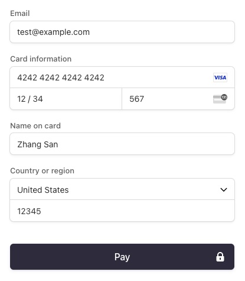

# Accept a Payment with Stripe Checkout

Stripe Checkout is the fastest way to get started with payments. Included are some basic build and run scripts you can use to start up the application.

## Running the sample

1. Run the server

~~~
go run server.go
~~~

2. Go to [http://localhost:4242/checkout.html](http://localhost:4242/checkout.html)

3. if using Test Cards:

When testing interactively, use a card number, such as 4242 4242 4242 4242. Enter the card number in the Dashboard or in any payment form.

Use a valid future date, such as 12/34.
Use any three-digit CVC (four digits for American Express cards).
Use any value you like for other form fields.

